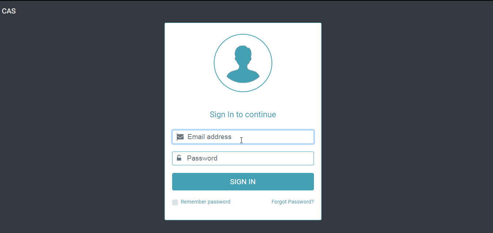
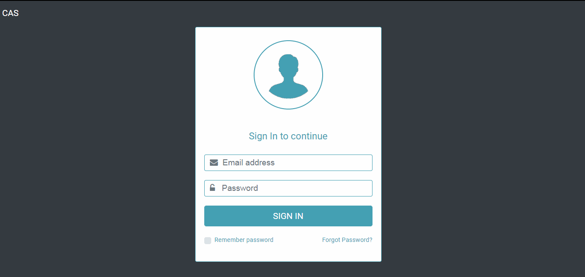

<h1 align="center" style="font-size:30px">C A S</h1>
CAS stands for Career Advancement Scheme.

It is a portal for colleges which can be used by faculty to apply for pay raises. This code has been specifically developed for K. J. Somaiya College of Engineering, Vidyavihar, Maharashtra, India but a little tweaking can enable this website to be used for other colleges also.

<h2>Setup:</h2>

Create a folder named "cas" inside the following path: xampp/htdocs/ and clone this repository in it.

Now create a database inside your phpmyadmin panel called "cas_db". Once this is done, open the database folder and import the cas_db.sql file into it. This should add all the required tables to the system.

<b>The website is now ready!</b>

<h3>Faculty Member POV</h3>

<h3>HOD Member POV</h3>

<h3>Important Points to Note</h3>

1. Configure your php.ini file as follows:

	Edit the line that says `max_file_uploads = 20`(or any number) to `max_file_uploads = 500`
